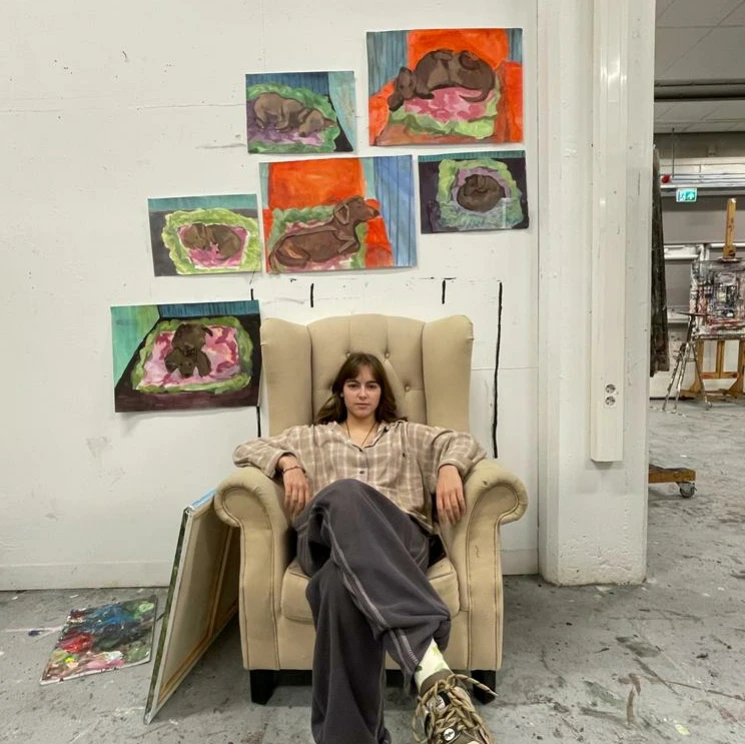
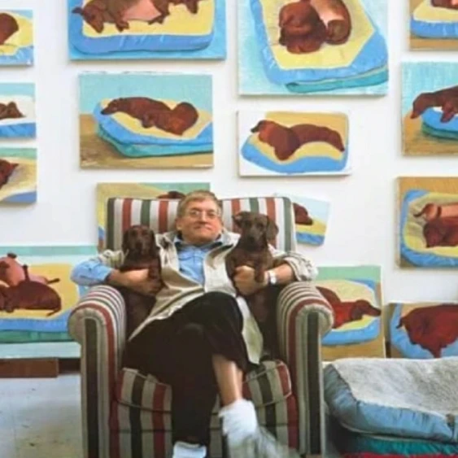
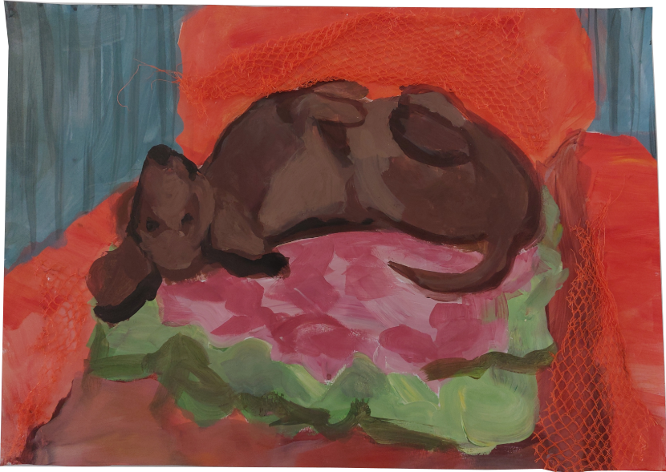

{.fullwidth}

{.halfwidth .left}

# Dog Nights

This project is highly inspired by David Hockney’s Dog Days (1995). I found pure joy in his work, and I got curious about his creative process. So to find out, I made my own Dog Days where I painted my family's dachshund sleeping in six different poses. In every painting I experimented with different materials. I truly loved this project and I totally understand now how David hockney could paint so many of these dogs. 

{.watmeermarge}
42cm × 59cm

42cm × 59cm

42cm × 59cm

29.5cm × 42cm

29.5cm × 42cm

29.5cm × 42cm
