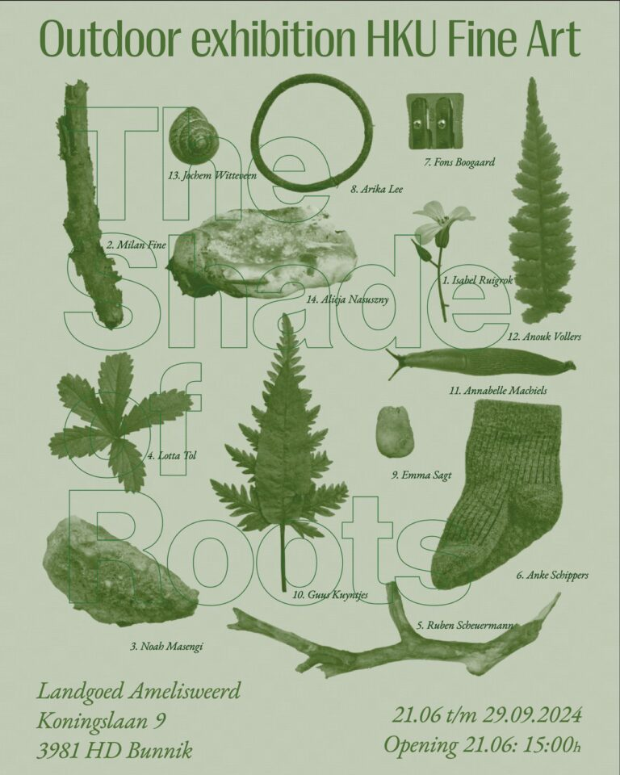
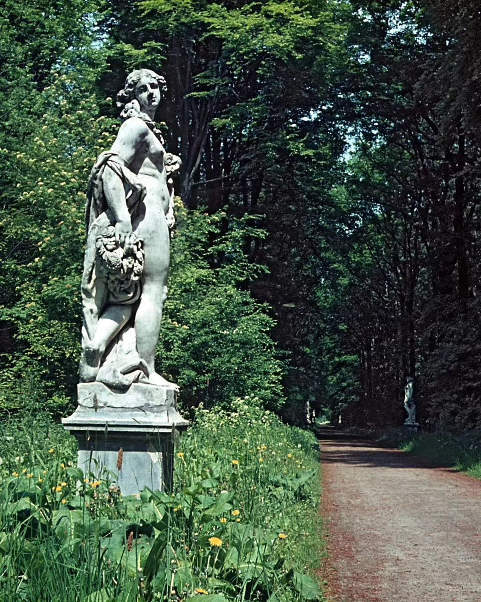
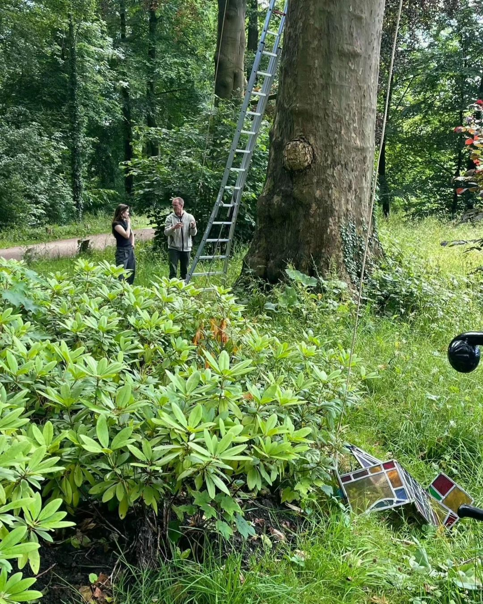
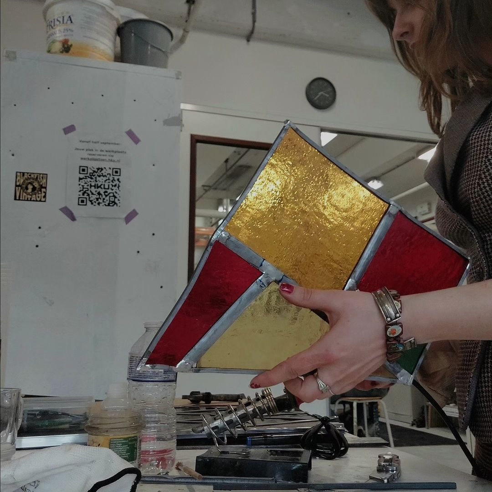
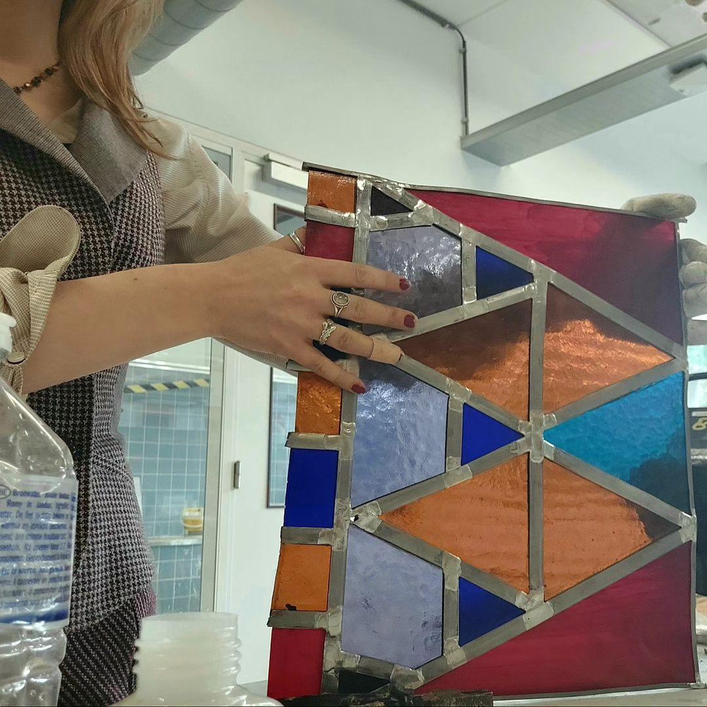
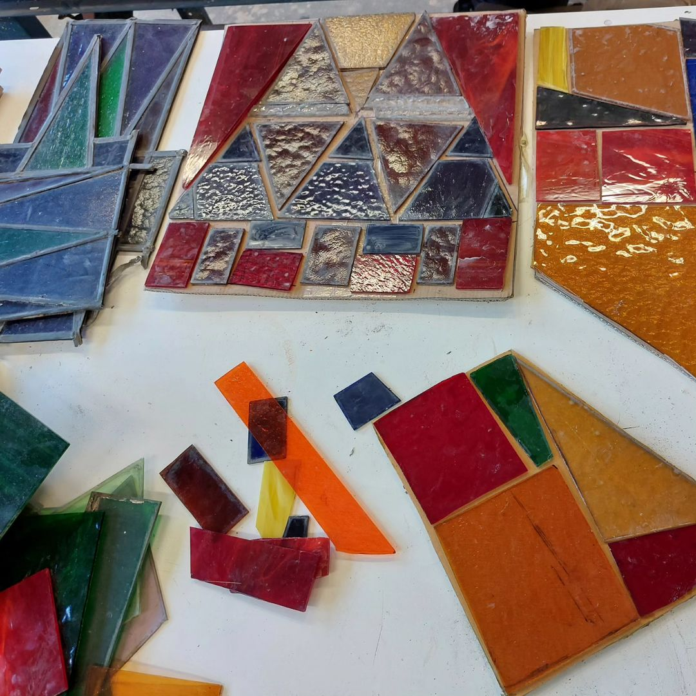
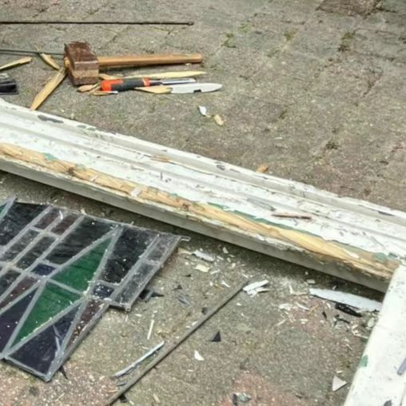

# the Shade of Roots
[Exhibition in the forest and 'beeldenlaan' of Oud Amelisweerd.](https://landhuisoudamelisweerd.nl/beeldenlaan-expositie-hku-fine-arts/)

below is a picture of the original 'beeldenlaan', filled with classical sculptures about the different seasons. 

With my sculpture I like bringing the stained glass that reflects the center city of Utrecht, in a different context.
Where it now also shows the historical time that nature and the 'beeldenlaan' brings.

## Process

I got [sponsored](https://www.weever-circulair.nl/publicaties-en-media/gesponsord-glas-in-lood-project-door-weever-circulair) by '[Weever, Circulaire Hub](https://www.weever-circulair.nl/)' (in Kampen)!
I got lots of glass for free as you can see in the second picture below!
Big thanks to Gerwin de Vries who has given me this opportunity!

